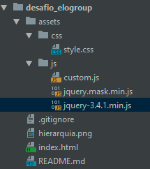

# Desafio de Programação EloGroup

### Bibliotecas utilizadas

`jQuery` : <https://jquery.com/>

`jQuery Mask Plugin` : <https://igorescobar.github.io/jQuery-Mask-Plugin/>

Biblioteca `jQuery` auxilia na manipulação do documento HTML.

O plugin `jQuery Mask Plugin` ajuda na aplicação máscaras em formulários.

---
### Hierarquia de arquivos

Pasta `desafio_elogroup` contém todos os arquivos do projeto;

Pasta `assets` contém as pastas `css` e  `js`;

A pasta `css` contém o arquivo `style.css` utilizado para customizar o formulário;

A pasta `js` contém os arquivos `jquery-3.4.1.min.js`, `jquery.mask.min.js` e o `custom.js`;

O arquivo `jquery-3.4.1.min.js` foi utilizado para validar os campos do formulário;

O arquivo `jquery.mask.min.js` foi utilizado para a inserção de mascara no campo de telefone;

O arquivo `custom.js` contém as as ações customizadas do formulário;

O arquivo `.gitignore` ignora os arquivos criados pela IDE que foi utilizada para escrever o código;

O arquivo `hierarquia.png` é um print da estrutura dos arquivos do projeto;

O arquivo `index.html` contém o código HTML do formulário;

O arquivo `README.md` descreve todos os dados do projeto;

##### Estrutura de arquivos

## Usuário utilizado na plataforma Gupy

Thiago Nascimento

thiagotnon@gmail.com
